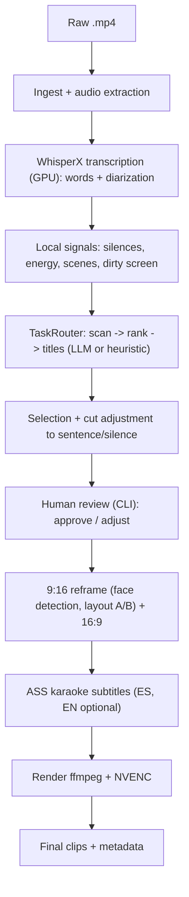

# Video Clipper — Design Spec

- **Date:** 2026-06-18
- **Status:** Approved for writing implementation plan
- **Author:** Ale (+ assistant)

## 1. Context and goal

Generate short-form content from the raw recordings of Ale's streams and training sessions.
The system must: analyze the raw video, detect interesting moments, extract clips from those
moments, reframe them to vertical (and horizontal), and subtitle them automatically.
Conceptual reference: Opus Clip, but adapted to Spanish educational content with a slide +
webcam layout.

MVP goal: validate the idea on **one real class** with quality good enough to publish, while
keeping full control, near-zero cost, and privacy.

## 2. Real material (findings from the sample recording)

Analyzed: `Formación Inicial en inteligencia artificial - Grupo 1 - 2026_06_08.mp4`.

- 1920x1080, 24 fps, H.264 + AAC 48kHz stereo audio. Duration ~93 min (~5580 s).
- It's a **Google Meet recording**:
  - The **webcam is a small tile** on the right (not a full-screen camera). Its position
    **varies** between moments (sometimes top-right, sometimes center-right) → a fixed crop
    can't be hardcoded; the **tile (face) must be detected**.
  - The **shared screen (slides)** occupies the center-left and is the valuable content
    (dense slides: treemaps, LLM charts, etc.).
- There are **"dirty" moments** where the screen shows the Meet UI, browser tabs, or
  NotebookLM → not usable as clips and must be discarded.
- Environment: **NVIDIA RTX 5060 Laptop** available → local processing is viable (WhisperX +
  NVENC).
- The installed `ffmpeg` is a full build (NVENC, libass, whisper).

Stacked-layout mockup generated from a real frame: `_analysis/frames/mockup_stacked.jpg`.

## 3. Scope

### MVP (in order)
1. Ingest an `.mp4` and extract audio.
2. Local transcription with word-level timestamps + diarization.
3. Local signals (silences, energy, scenes, "dirty screen" detection).
4. Moment detection/scoring via `TaskRouter` (MVP: a single model; heuristic fallback).
5. Cut adjustment to sentence/silence boundaries.
6. Human review via **CLI** (list candidates, approve/adjust).
7. 9:16 **stacked (Layout A)** reframe with automatic **Layout B** when the slide is central;
   also export 16:9.
8. Spanish ASS karaoke subtitles (optional EN track via translation).
9. Render with ffmpeg + NVENC.

### MVP non-goals (later roadmap)
- Web review UI (MVP uses CLI).
- True best-of-breed multi-model (the architecture supports it; the MVP uses one model).
- B-roll, background music, automatic publishing/scheduling to social.
- Complex multi-speaker support / split-screen of several people.

## 4. Design decisions (agreed)

| Decision | Choice |
|---|---|
| Approach | Local-first hybrid (everything local except LLM scoring) |
| Detection brain | Configurable `TaskRouter` (tasks→models). MVP: Claude on all tasks + local heuristic fallback |
| Default LLM provider | Claude Sonnet (configurable via env var). No keys yet → heuristic fallback for testing |
| Privacy | Content is rarely confidential; sending text to the API is allowed. Local option in the future |
| Vertical layout | A (stacked) default; B (screen-focus) automatic when the slide is central |
| Output formats | 9:16 and 16:9 |
| Languages | ES always; EN optional (translation) |
| Review | Human-in-the-loop (CLI in the MVP) |
| Start | MVP on one real class, then iterate |

## 5. Overall architecture



Principle: each stage is a module with a clear responsibility, a defined interface, and
isolated testability. Data flows as artifacts on disk (JSON + intermediate media) so stages
can be re-run without redoing everything.

## 6. Components and interfaces

Python sketches (orientative, not final):

```python
# Central data model
@dataclass
class Word:
    text: str
    start: float
    end: float
    speaker: str | None

@dataclass
class ClipCandidate:
    id: str
    start: float
    end: float
    score: float            # 0-100
    reason: str             # why it's clippable
    title: str
    hook: str
    transcript: str
    layout: str             # "A" | "B"
    status: str             # proposed | approved | rejected | edited
    captions_path: str | None = None

# Interfaces (Protocols)
class Transcriber(Protocol):
    def transcribe(self, audio_path: str) -> list[Word]: ...

class SignalExtractor(Protocol):
    def extract(self, video_path: str, words: list[Word]) -> Signals: ...

class TaskRouter(Protocol):
    # named tasks: "scan" | "rank" | "titles" | "translate" | "visual_check"
    def run(self, task: str, payload: dict) -> dict: ...

class MomentScorer(Protocol):
    def propose(self, words: list[Word], signals: Signals) -> list[ClipCandidate]: ...

class Reframer(Protocol):
    def reframe(self, video: str, clip: ClipCandidate) -> str: ...  # returns 9:16 path

class Captioner(Protocol):
    def build_ass(self, words: list[Word], clip: ClipCandidate, lang: str) -> str: ...

class Renderer(Protocol):
    def render(self, video: str, clip: ClipCandidate, ass_path: str) -> str: ...
```

### MVP implementations
- `WhisperXTranscriber` (local, GPU).
- `LocalSignalExtractor` (ffmpeg/librosa + dirty-screen detection via visual heuristic).
- `LLMRouter` with a Claude backend; `HeuristicRouter`/`HeuristicScorer` as the no-API fallback.
- `StackedReframer` (layouts A/B + face detection to locate the webcam tile).
- `AssCaptioner` (ES karaoke; EN via the "translate" task).
- `NvencRenderer`.

## 7. Data flow and artifacts

A workdir is created per raw video:

```
workdir/<class>/
  audio.wav
  transcript.json          # list[Word] + diarization
  signals.json             # silences, energy, scenes, "dirty" segments
  candidates.json          # list[ClipCandidate] (review state)
  clips/
    <clip_id>.ass          # subtitles
    <clip_id>_9x16.mp4
    <clip_id>_16x9.mp4
```

Each stage reads/writes these artifacts → incremental re-execution per stage.

## 8. Vertical layout logic (A vs automatic B)

- **A (stacked):** slide on top, webcam in the middle, subtitles at the bottom. Default.
- **B (screen-focus):** slide near full, small webcam in a corner. Chosen when the moment is
  predominantly visual / the slide is the center of attention.
- A/B selection heuristic (MVP, refinable):
  - If the clip range has high on-screen content density (lots of detected text/graphics) and
    little "look at me" reference → **B**.
  - If it's spoken explanation / the face is central → **A**.
  - A future multimodal signal (task `visual_check`) can improve this decision.
- If the range falls on a "dirty" segment, that stretch is trimmed or discarded.

## 9. Stack and dependencies

- **Language:** Python 3.11+.
- **ASR:** WhisperX (large-v3) on CUDA.
- **Audio/signals:** ffmpeg, librosa/numpy.
- **Face detection:** MediaPipe or YOLO-face (to locate the webcam tile).
- **LLM:** provider SDK (Anthropic by default), behind the `TaskRouter`.
- **Subtitles:** custom ASS generation (karaoke) + libass (ffmpeg).
- **Render:** ffmpeg with `h264_nvenc`.
- **CLI:** Typer or argparse.
- **Environment management:** `requirements.txt` (or `uv`/`pyproject`), config via `.env`.

## 10. Project structure (proposed)

```
video_clipper/
  src/video_clipper/
    ingest.py
    transcribe.py
    signals.py
    router.py            # TaskRouter + backends (LLM, heuristic)
    scoring.py           # MomentScorer
    selection.py         # cut adjustment
    review.py            # human-review CLI
    reframe.py           # layouts A/B + face detection
    captions.py          # ASS karaoke + translation
    render.py            # NVENC
    pipeline.py          # orchestration
    models.py            # dataclasses
    config.py
  docs/specs/
  tests/
  requirements.txt
  README.md
```

## 11. Error handling and edge cases

- Raw video with no/little voice in a stretch → no candidates generated there.
- No API key → use `HeuristicScorer` and warn in the log.
- Webcam undetectable in a frame → fall back to the last known position or to Layout B.
- "Dirty" stretch inside an approved clip → trim the sub-range or flag a warning.
- Cuts that would split a word → snap to the nearest sentence/silence boundary.
- NVENC failure → fall back to the CPU encoder (`libx264`).

## 12. Testing

- Unit: transcript parsing, cut adjustment (snap to sentences), ASS generation, A/B layout
  selection (with signal fixtures).
- Integration: pipeline over a short fragment (~5 min) extracted from the real class.
- Manual validation: visually review N clips from the real recording (MVP acceptance
  criterion).
- Golden frames: the layout mockup serves as a visual reference.

## 13. Post-MVP roadmap

- True best-of-breed in the `TaskRouter` (Gemini Flash for `scan`, Claude for `rank`,
  filter→refine pattern).
- Local web review UI (FastAPI + front end) with preview and subtitle editing.
- Multimodal `visual_check` to improve A/B and dirty-screen rejection.
- B-roll, music, branding, export/scheduling to social.
- Local LLM scorer for confidential cases.

## 14. Risks and open questions

- **Moment-detection quality** without an API (heuristic fallback) will be limited; the real
  value appears with an LLM → getting an API key is an early priority.
- **VRAM (~8GB):** running WhisperX and a local LLM simultaneously doesn't fit → if a local
  LLM is used, run sequentially.
- **Webcam tile detection** with a varying position: validate robustness across several frames.
- **A/B heuristic:** a point to iterate with real feedback.
```
