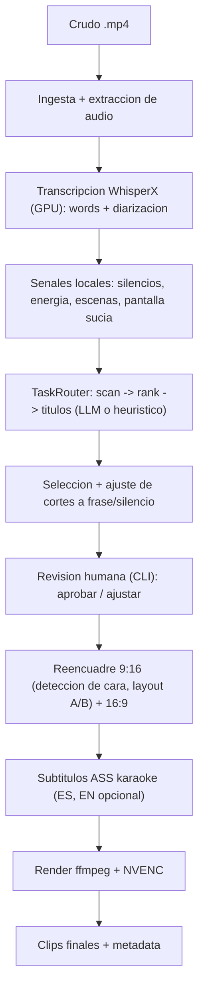

# Video Clipper — Spec de Diseño

- **Fecha:** 2026-06-18
- **Estado:** Aprobado para escribir plan de implementación
- **Autor:** Ale (+ asistente)

## 1. Contexto y objetivo

Generar contenido corto a partir de los crudos de streams y capacitaciones que da Ale.
El sistema debe: analizar el crudo, detectar momentos interesantes, extraer clips de esos
momentos, reencuadrarlos a vertical (y horizontal) y subtitularlos automáticamente.
Referencia conceptual: Opus Clip, pero adaptado a contenido educativo en español con
layout slide + webcam.

Objetivo del MVP: validar la idea sobre **una clase real** con calidad suficiente para
publicar, manteniendo control total, costo casi nulo y privacidad.

## 2. Material real (hallazgos del crudo de muestra)

Analizado: `Formación Inicial en inteligencia artificial - Grupo 1 - 2026_06_08.mp4`.

- 1920x1080, 24 fps, H.264 + audio AAC 48kHz estéreo. Duración ~93 min (~5580 s).
- Es una **grabación de Google Meet**:
  - La **webcam es un recuadro chico** ubicado a la derecha (no cámara a pantalla completa).
    Su posición **varía** entre momentos (a veces arriba-derecha, a veces centro-derecha)
    → no se puede hardcodear un crop fijo; hay que **detectar el tile** (cara).
  - La **pantalla compartida (slides)** ocupa el centro-izquierda y es el contenido valioso
    (slides densas: treemaps, gráficos de LLMs, etc.).
- Hay **momentos "sucios"** donde la pantalla muestra la UI de Meet, pestañas del navegador
  o NotebookLM → no sirven como clip y deben descartarse.
- Entorno: **NVIDIA RTX 5060 Laptop** disponible → procesamiento local viable (WhisperX + NVENC).
- `ffmpeg` instalado es build completo (NVENC, libass, whisper).

Mockup de layout apilado generado a partir de un frame real:
`_analysis/frames/mockup_stacked.jpg`.

## 3. Alcance

### MVP (en orden)
1. Ingesta de un `.mp4` y extracción de audio.
2. Transcripción local con timestamps por palabra + diarización.
3. Señales locales (silencios, energía, escenas, detección de "pantalla sucia").
4. Detección/scoring de momentos vía `TaskRouter` (MVP: un solo modelo; fallback heurístico).
5. Ajuste de cortes a límites de frase/silencio.
6. Revisión humana por **CLI** (listar candidatos, aprobar/ajustar).
7. Reencuadre 9:16 **apilado (Layout A)** con **Layout B automático** cuando la slide es central;
   export también en 16:9.
8. Subtítulos ASS karaoke en español (pista EN opcional por traducción).
9. Render con ffmpeg + NVENC.

### No-objetivos del MVP (roadmap posterior)
- UI web de revisión (MVP usa CLI).
- Best-of-breed multi-modelo real (la arquitectura lo soporta; el MVP usa un modelo).
- B-roll, música de fondo, publicación/scheduling automático en redes.
- Soporte multi-speaker complejo / split-screen de varias personas.

## 4. Decisiones de diseño (acordadas)

| Decisión | Elección |
|---|---|
| Enfoque | Híbrido local-first (todo local salvo el scoring por LLM) |
| Cerebro de detección | `TaskRouter` (tareas→modelos) configurable. MVP: Claude en todas las tareas + fallback heurístico local |
| Proveedor LLM default | Claude Sonnet (configurable por env var). Sin keys aún → fallback heurístico para testear |
| Privacidad | Contenido rara vez confidencial; se permite mandar texto a la API. Opción local futura |
| Layout vertical | A (apilado) default; B (pantalla protagonista) automático cuando la slide es central |
| Formatos de salida | 9:16 y 16:9 |
| Idiomas | ES siempre; EN opcional (traducción) |
| Revisión | Human-in-the-loop (CLI en MVP) |
| Arranque | MVP sobre una clase real, iterar |

## 5. Arquitectura general



Principio: cada etapa es un módulo con una responsabilidad clara, interfaz definida y
testeable de forma aislada. Los datos fluyen como artefactos en disco (JSON + media
intermedia) para poder re-correr etapas sin rehacer todo.

## 6. Componentes e interfaces

Sketches en Python (no definitivos, orientativos):

```python
# Modelo de datos central
@dataclass
class Word:
    text: str
    start: float
    end: float
    speaker: str | None

@dataclass
class ClipCandidate:
    id: str
    start: float
    end: float
    score: float            # 0-100
    reason: str             # por que es clipeable
    title: str
    hook: str
    transcript: str
    layout: str             # "A" | "B"
    status: str             # proposed | approved | rejected | edited
    captions_path: str | None = None

# Interfaces (Protocols)
class Transcriber(Protocol):
    def transcribe(self, audio_path: str) -> list[Word]: ...

class SignalExtractor(Protocol):
    def extract(self, video_path: str, words: list[Word]) -> Signals: ...

class TaskRouter(Protocol):
    # tareas nombradas: "scan" | "rank" | "titles" | "translate" | "visual_check"
    def run(self, task: str, payload: dict) -> dict: ...

class MomentScorer(Protocol):
    def propose(self, words: list[Word], signals: Signals) -> list[ClipCandidate]: ...

class Reframer(Protocol):
    def reframe(self, video: str, clip: ClipCandidate) -> str: ...  # devuelve path 9:16

class Captioner(Protocol):
    def build_ass(self, words: list[Word], clip: ClipCandidate, lang: str) -> str: ...

class Renderer(Protocol):
    def render(self, video: str, clip: ClipCandidate, ass_path: str) -> str: ...
```

### Implementaciones MVP
- `WhisperXTranscriber` (local, GPU).
- `LocalSignalExtractor` (ffmpeg/librosa + detección de pantalla sucia por heurística visual).
- `LLMRouter` con backend Claude; `HeuristicRouter`/`HeuristicScorer` de fallback sin API.
- `StackedReframer` (layouts A/B + detección de cara para ubicar el tile webcam).
- `AssCaptioner` (karaoke ES; EN vía task "translate").
- `NvencRenderer`.

## 7. Flujo de datos y artefactos

Por cada crudo se crea un workdir:

```
workdir/<clase>/
  audio.wav
  transcript.json          # list[Word] + diarizacion
  signals.json             # silencios, energia, escenas, segmentos "sucios"
  candidates.json          # list[ClipCandidate] (estado de revision)
  clips/
    <clip_id>.ass          # subtitulos
    <clip_id>_9x16.mp4
    <clip_id>_16x9.mp4
```

Cada etapa lee/escribe estos artefactos → re-ejecución incremental por etapa.

## 8. Lógica de layout vertical (A vs B automático)

- **A (apilado):** slide arriba, webcam al medio, subtítulos abajo. Default.
- **B (pantalla protagonista):** slide casi full, webcam chica en esquina. Se elige cuando
  el momento es predominantemente visual / la slide es el centro de atención.
- Heurística de selección A/B (MVP, refinable):
  - Si en el rango del clip hay densidad alta de contenido en pantalla (mucho texto/gráfico
    detectado) y poca referencia a "mirame a mí" → **B**.
  - Si es explicación hablada / la cara es lo central → **A**.
  - Señal multimodal futura (task `visual_check`) puede mejorar esta decisión.
- Si el rango cae sobre un segmento "sucio", se recorta o descarta ese tramo.

## 9. Stack y dependencias

- **Lenguaje:** Python 3.11+.
- **ASR:** WhisperX (large-v3) sobre CUDA.
- **Audio/señales:** ffmpeg, librosa/numpy.
- **Detección de cara:** MediaPipe o YOLO-face (ubicar tile de webcam).
- **LLM:** SDK del proveedor (Anthropic por default), detrás del `TaskRouter`.
- **Subtítulos:** generación ASS propia (karaoke) + libass (ffmpeg).
- **Render:** ffmpeg con `h264_nvenc`.
- **CLI:** Typer o argparse.
- **Gestión de entorno:** `requirements.txt` (o `uv`/`pyproject`), config por `.env`.

## 10. Estructura del proyecto (propuesta)

```
video_clipper/
  src/video_clipper/
    ingest.py
    transcribe.py
    signals.py
    router.py            # TaskRouter + backends (LLM, heuristico)
    scoring.py           # MomentScorer
    selection.py         # ajuste de cortes
    review.py            # CLI de revision humana
    reframe.py           # layouts A/B + deteccion de cara
    captions.py          # ASS karaoke + traduccion
    render.py            # NVENC
    pipeline.py          # orquestacion
    models.py            # dataclasses
    config.py
  docs/specs/
  tests/
  requirements.txt
  README.md
```

## 11. Manejo de errores y casos borde

- Crudo sin/poca voz en un tramo → no genera candidatos ahí.
- Sin API key → usar `HeuristicScorer` y avisar por log.
- Webcam no detectable en un frame → fallback a última posición conocida o a Layout B.
- Tramo "sucio" dentro de un clip aprobado → recortar el subtramo o marcar warning.
- Cortes que partirían una palabra → snap al límite de frase/silencio más cercano.
- Falla de NVENC → fallback a encoder CPU (`libx264`).

## 12. Testing

- Unit: parsing de transcript, ajuste de cortes (snap a frases), generación de ASS,
  selección de layout A/B (con fixtures de señales).
- Integración: pipeline sobre un fragmento corto (~5 min) extraído de la clase real.
- Validación manual: revisar visualmente N clips del crudo real (criterio de aceptación
  del MVP).
- Golden frames: el mockup de layout sirve como referencia visual.

## 13. Roadmap post-MVP

- Best-of-breed real en el `TaskRouter` (Gemini Flash para `scan`, Claude para `rank`,
  patrón filtro→refinamiento).
- UI web local de revisión (FastAPI + front) con preview y edición de subtítulos.
- `visual_check` multimodal para mejorar A/B y descarte de pantalla sucia.
- B-roll, música, branding, export/scheduling a redes.
- Scorer LLM local para casos confidenciales.

## 14. Riesgos y preguntas abiertas

- **Calidad de la detección de momentos** sin API (fallback heurístico) será limitada;
  el valor real aparece con LLM → conseguir una API key es prioridad temprana.
- **VRAM (~8GB):** correr WhisperX y un LLM local en simultáneo no entra → si se usa LLM
  local, ejecutar secuencial.
- **Detección del tile de webcam** ante posición variable: validar robustez sobre varios frames.
- **Heurística A/B:** punto a iterar con feedback real.
```
